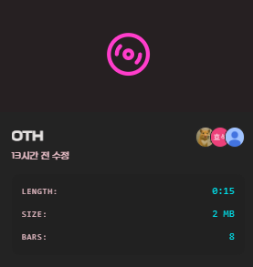
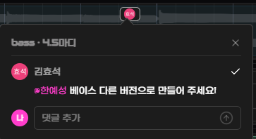
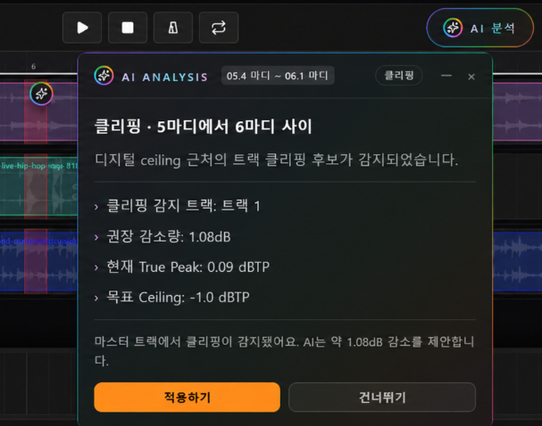
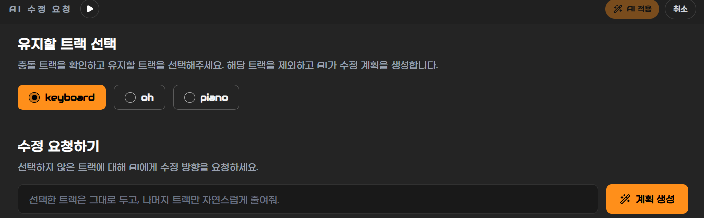
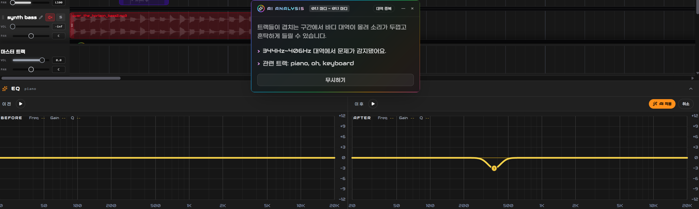
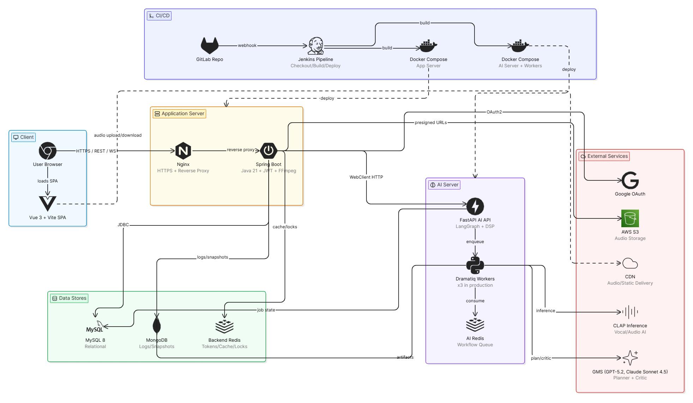
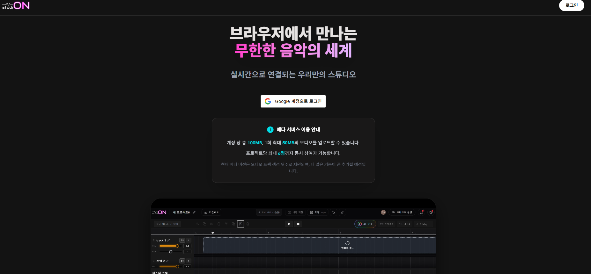
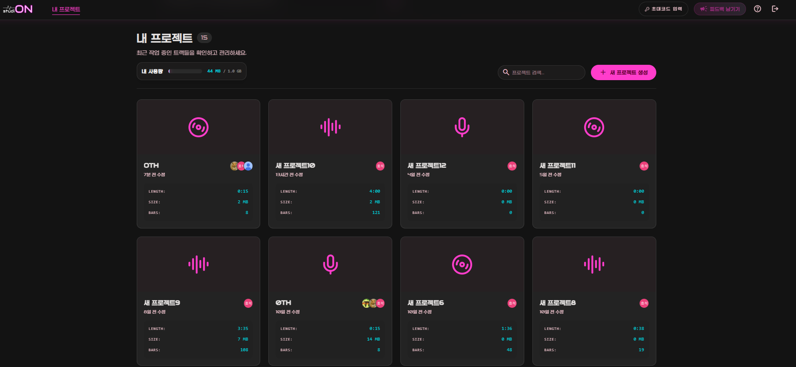

<div align="center">


# 🎧 studiON

### 당신이 있는 곳 어디든, 스튜디오가 되다

AI 기반 음악 협업 플랫폼

[📄 발표 자료](./FE/public/studiON.pdf)

</div>

---

## 🎬 Preview

<p align="center">
</video>
</p>

---

# 🎵 프로젝트 소개

음악 협업은 생각보다 비효율적입니다.

작업 파일은 메일, 메신저, 클라우드에 흩어지고,

누가 최신 버전을 가지고 있는지 알기 어렵습니다.

피드백은 채팅방 위로 밀려나고,

믹싱 과정의 문제는 직접 들어보기 전까지 발견하기 어렵습니다.

**studiON은 이러한 음악 협업 과정의 비효율을 해결하기 위해 만들어진 웹 기반 협업 플랫폼입니다.**

하나의 프로젝트 공간 안에서

* 음원을 공유하고
* 작업 진행 상황을 확인하며
* 구간별 피드백을 주고받고
* AI 분석 결과를 기반으로 믹싱 품질을 개선할 수 있습니다.

더 이상 `final.wav`, `final_real.wav`, `final_real_final.wav`를 주고받지 않아도 됩니다.

---

# 🚀 주요 기능

## 🎚 프로젝트 기반 협업

하나의 프로젝트 공간에서 여러 사용자가 함께 작업할 수 있습니다.

* 프로젝트 생성 및 초대
* 팀원 단위 협업
* 실시간 작업 동기화
* 작업 상태 공유

<p align="center">

</p>

---

## 💬 타임라인 코멘트

특정 구간에 직접 의견을 남기고 피드백을 주고받을 수 있습니다.

* 구간 단위 댓글 작성
* 작업 맥락 유지
* 협업 기록 관리
* 실시간 피드백 확인

<p align="center">

</p>

---

## 🤖 AI 오디오 분석

AI가 믹싱 과정에서 발생하는 문제를 자동으로 분석합니다.

분석 항목

* 주파수 충돌
* 클리핑
* 치찰음
* 하이 대역 과다
* 밸런스 문제

<p align="center">

</p>

---

## 🎛 AI EQ 제안

분석 결과를 기반으로 EQ 조정 방향을 제안합니다.

* 문제 구간 시각화
* EQ 적용 전후 비교
* 추천값 확인
* 사용자 판단 보조

<p align="center">

</p>
<p align="center">

</p>

---


# 🏗 시스템 아키텍처

<p align="center">

</p>

studiON은 Frontend, Backend, AI Server가 분리된 구조로 구성되어 있습니다.

### Frontend

Vue 기반 웹 클라이언트

* 프로젝트 편집
* 타임라인
* 코멘트
* EQ UI
* 대시보드

### Backend

Spring Boot 기반 API 서버

* 인증
* 프로젝트 관리
* 트랙 및 클립 관리
* 협업 기능
* 실시간 통신

### AI Server

FastAPI 기반 분석 서버

* 음원 분석
* AI 피드백 생성
* EQ 추천
* 비동기 분석 처리

---

# 🛠 기술 스택

## Frontend

| Category   | Stack                  |
| ---------- | ---------------------- |
| Language   | TypeScript             |
| Framework  | Vue 3                  |
| Build Tool | Vite                   |
| State      | Pinia                  |
| UI         | Tailwind CSS, Reka UI  |
| Network    | Axios                  |
| Realtime   | STOMP, SockJS          |
| Audio      | Tone.js, Web Audio API |

---

## Backend

| Category  | Stack                        |
| --------- | ---------------------------- |
| Language  | Java 21                      |
| Framework | Spring Boot                  |
| Security  | Spring Security, OAuth2, JWT |
| ORM       | Spring Data JPA, QueryDSL    |
| Database  | MySQL, MongoDB, Redis        |
| Realtime  | Spring WebSocket             |
| Migration | Flyway                       |
| Docs      | Swagger                      |

---

## AI

| Category         | Stack                 |
| ---------------- | --------------------- |
| Language         | Python                |
| Framework        | FastAPI               |
| Workflow         | LangGraph             |
| Queue            | Dramatiq              |
| Audio Processing | Librosa, NumPy        |
| Vector DB        | Qdrant                |
| LLM              | OpenAI Compatible API |

---

## Infra

| Category        | Stack   |
| --------------- | ------- |
| Container       | Docker  |
| Reverse Proxy   | Nginx   |
| CI/CD           | Jenkins |
| SSL             | Certbot |
| Version Control | GitLab  |

---

# 📂 프로젝트 구조

```text
.
├── FE
│   └── Frontend Source
│
├── BE
│   └── Backend Source
│
├── AI
│   └── AI Analysis Server
│
├── INFRA
│   └── Deployment Configuration
│
├── docs
│   └── Project Documents
│
├── compose.dev.yaml
└── compose.prod.yaml
```

---

# 📸 서비스 화면

## 온보딩

서비스 소개 및 초기 사용자 경험 제공



---

## 대시보드

프로젝트 생성 및 관리



---

## 프로젝트 편집

오디오 협업 작업 공간


---

# 👥 팀 소개

| 프로필                                                                                                                   | 이름  | 역할                     |
| --------------------------------------------------------------------------------------------------------------------- | --- | ---------------------- |
| <a href="https://github.com/hyoseok8948"></a>       | 김효석 | Team Leader · Frontend |
| <a href="https://github.com/bin3joo"></a>               | 주세빈 | PM · Frontend          |
| <a href="https://github.com/jeongns2611"></a>       | 윤정아 | Backend                |
| <a href="https://github.com/Charmander0308"></a> | 한예성 | Backend                |
| <a href="https://github.com/kyubongg"></a>             | 유규봉 | AI                     |
| <a href="https://github.com/seoliee"></a>               | 이서현 | Infra                  |

---

# 🏆 프로젝트 정보

| 항목      | 내용                      |
| ------- | ----------------------- |
| 프로젝트명   | studiON                 |
| 진행 기간   | 2026.04.06 ~ 2026.05.21 |
| 개발 인원   | 6명                      |
| 프로젝트 유형 | SSAFY 자율 프로젝트           |
| 서비스 형태  | Web Application         |

---

<div align="center">

### Team Studio Salmon 🐠

음악 협업의 새로운 작업 공간

**studiON**

</div>

